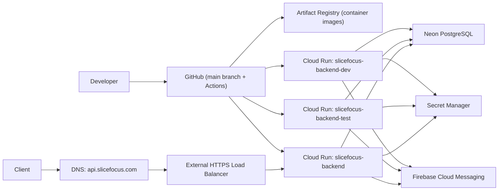

# SliceFocus Architecture

## Scope
This document describes the current backend architecture for SliceFocus MVP deployment on GCP, including release flow and environment separation.
For application-level system design (layers, request flow, data design), see `docs/system-design.md`.

## High-Level Design

## Release Model
- Trunk-based development with `main` as the long-lived integration branch.
- Push to `main` triggers automatic deploy to `dev`.
- `test` and `prod` are promoted manually using the same image tag.
- Promotion uses `SKIP_BUILD=true` to avoid rebuilding and keep artifact parity across environments.

## Environment Matrix
| Environment | Spring Profile | Cloud Run Service | Exposure | Deploy Trigger | Workflow | Image Build | DB Secret Names | Primary URL |
| --- | --- | --- | --- | --- | --- | --- | --- | --- |
| `dev` | `dev` | `slicefocus-backend-dev` | Public (current default) | Push to `main` or manual run | `.github/workflows/deploy-dev.yml` | Yes (`SKIP_BUILD=false`) | `slicefocus-dev-db-url`, `slicefocus-dev-db-user`, `slicefocus-dev-db-pass` | Cloud Run URL |
| `test` | `test` | `slicefocus-backend-test` | Public (current default) | Manual promotion | `.github/workflows/deploy-test.yml` | No (`SKIP_BUILD=true`) | `slicefocus-test-db-url`, `slicefocus-test-db-user`, `slicefocus-test-db-pass` | Cloud Run URL |
| `prod` | `prod` | `slicefocus-backend` | Private by default (`ALLOW_UNAUTHENTICATED=false`) | Manual promotion | `.github/workflows/deploy-prod.yml` | No (`SKIP_BUILD=true`) | `slicefocus-prod-db-url`, `slicefocus-prod-db-user`, `slicefocus-prod-db-pass` | `https://api.slicefocus.com` |

### Firebase Secrets per Environment
| Environment | Firebase Credentials Secret | Enabled Flag |
| --- | --- | --- |
| `dev` | `slicefocus-dev-firebase-credentials` | `SLICEFOCUS_FIREBASE_ENABLED` set by `deploy.sh` based on secret existence |
| `test` | `slicefocus-test-firebase-credentials` | Same |
| `prod` | `slicefocus-prod-firebase-credentials` | Same |

Firebase is **opt-in per environment**: if the credentials secret does not exist in Secret Manager, `deploy.sh` sets `SLICEFOCUS_FIREBASE_ENABLED=false` and push notifications are silently disabled. No deploy failure occurs.

### APNS Secrets per Environment
| Environment | APNS Key Secret | Enabled Flag |
| --- | --- | --- |
| `dev` | `slicefocus-dev-apns-key` | `SLICEFOCUS_APNS_ENABLED` set by `deploy.sh` based on secret existence |
| `test` | `slicefocus-test-apns-key` | Same |
| `prod` | `slicefocus-prod-apns-key` | Same |

APNS follows the same opt-in pattern as Firebase. Used for Live Activity content-state updates — the widget computes phases locally from session config, Cloud Tasks triggers re-renders at phase boundaries (see [ADR-037](https://github.com/AnunnakiCosmoCrew/slicefocus-docs/blob/main/adr/037-client-computed-live-activity-timeline.md), [ADR-038](https://github.com/AnunnakiCosmoCrew/slicefocus-docs/blob/main/adr/038-cloud-tasks-phase-scheduling.md)).

### Cloud Tasks Configuration
| Property | Purpose |
| --- | --- |
| `SLICEFOCUS_CLOUD_TASKS_ENABLED` | Feature toggle (`true`/`false`) |
| `GOOGLE_CLOUD_PROJECT` | GCP project ID |
| `CLOUD_TASKS_LOCATION` | Queue location (e.g., `europe-west3`) |
| `CLOUD_TASKS_QUEUE` | Queue name (`phase-transitions`) |
| `CLOUD_RUN_SERVICE_URL` | Webhook target URL + OIDC audience |
| `CLOUD_TASKS_SA_EMAIL` | Service account for OIDC token signing |

Cloud Tasks uses the REST API directly (no gRPC client library) with Application Default Credentials. Queue `phase-transitions` is created in `europe-west3`. Cloud Run SA has `roles/cloudtasks.enqueuer`; Cloud Tasks SA has `roles/run.invoker`.

### Keep-Alive (Dev/Test)
Cloud Scheduler pings `/actuator/health` every 4 minutes on dev and test environments to prevent Cloud Run and Neon cold starts. Prod uses `MIN_INSTANCES=1`.

## Core Infrastructure Decisions
- Runtime is Cloud Run for low-ops deployment and managed scaling.
- Database is Neon PostgreSQL for MVP cost efficiency.
- Secrets are stored in GCP Secret Manager and injected during deploy.
- Push notifications use Firebase Admin SDK (FCM) for regular notifications and direct APNS HTTP/2 for Live Activity updates. Cloud Tasks schedules APNS pushes at Pomodoro phase boundaries (ADR-038). Firebase credentials are stored in Secret Manager and injected as `FIREBASE_CREDENTIALS_JSON` at deploy time. APNS key is stored similarly as `APNS_PRIVATE_KEY_BASE64`. Both are opt-in per environment.
- HTTPS custom domain for prod is provided via External HTTPS Load Balancer.
- CI/CD uses GitHub Actions with Workload Identity Federation (OIDC), not static service account keys.

## Security Posture
- Production service is configured private-by-default.
- Production access is intended via authorized identities (`roles/run.invoker`) or a future explicit public API policy.
- Dev and test are currently public for faster iteration and can be hardened later if needed.
- Firebase service account credentials are stored in Secret Manager (one secret per environment), never in source control or GitHub Secrets. The Cloud Run runtime service account is granted `roles/secretmanager.secretAccessor` on the Firebase secret by `deploy.sh`.

## Key Config Inputs
- GitHub repository variables:
  - `GCP_PROJECT_ID`
  - `GCP_REGION` (default `europe-west3`)
  - `GCP_ARTIFACT_REPO` (default `slicefocus-repo`)
  - `CLOUD_RUN_SERVICE_DEV`
  - `CLOUD_RUN_SERVICE_TEST`
  - `CLOUD_RUN_SERVICE_PROD`
  - `PROD_ALLOW_UNAUTHENTICATED`
- GitHub repository secrets:
  - `GCP_WORKLOAD_IDENTITY_PROVIDER`
  - `GCP_DEPLOY_SERVICE_ACCOUNT`
- GCP Secret Manager secrets (per environment, managed outside CI):
  - `slicefocus-{env}-firebase-credentials` — Firebase service account JSON for FCM
  - `slicefocus-{env}-apns-key` — Apple Developer private key (.p8) for APNS Live Activity updates
- Cloud Run environment variables (set by `deploy.sh`):
  - `SPRING_PROFILES_ACTIVE` — Spring profile for the target environment
  - `SLICEFOCUS_FIREBASE_ENABLED` — `true`/`false` based on Firebase secret existence
  - `FIREBASE_CREDENTIALS_JSON` — injected from Secret Manager (only when secret exists)
  - `SLICEFOCUS_APNS_ENABLED` — `true`/`false` based on APNS key secret existence
  - `APNS_PRIVATE_KEY_BASE64` — injected from Secret Manager (only when secret exists)
  - `APNS_KEY_ID`, `APNS_TEAM_ID` — Apple Developer identifiers for APNS JWT auth

## Related Documents
- Operational procedures: `OPERATIONS.md`
- Step-by-step actions and incident handling: `docs/runbook.md`
