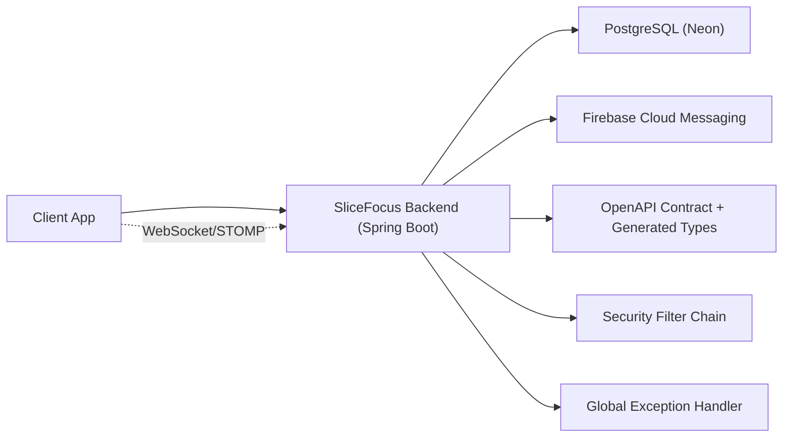
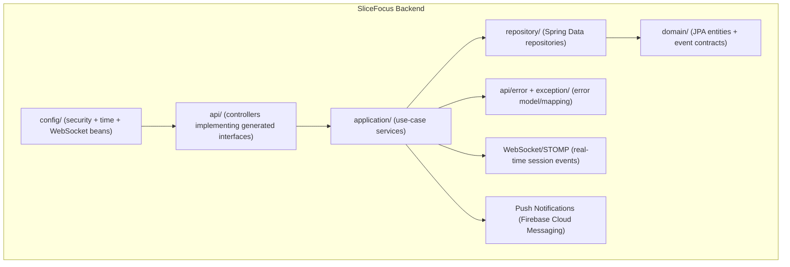
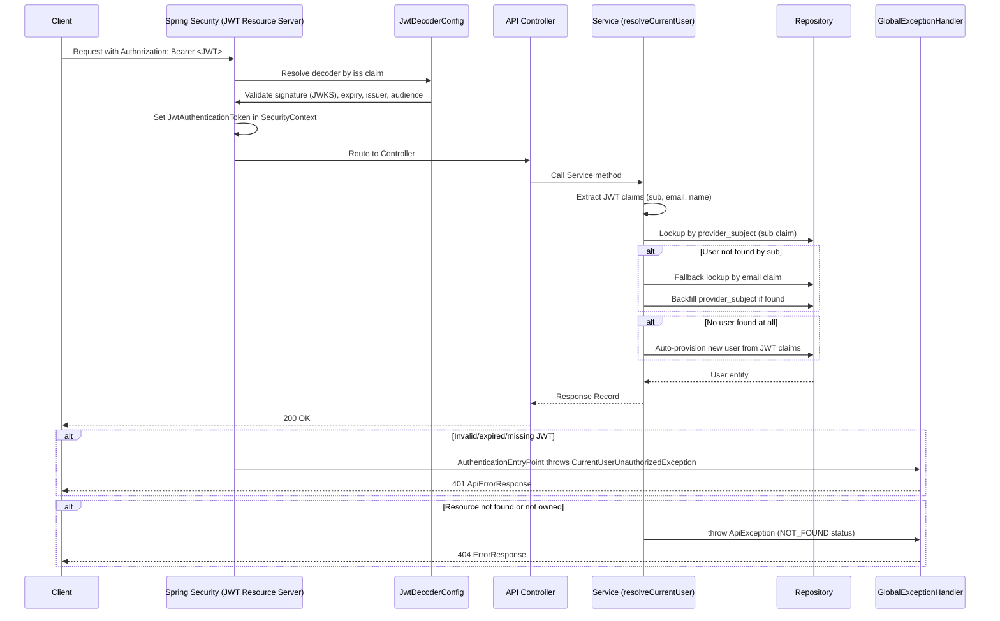
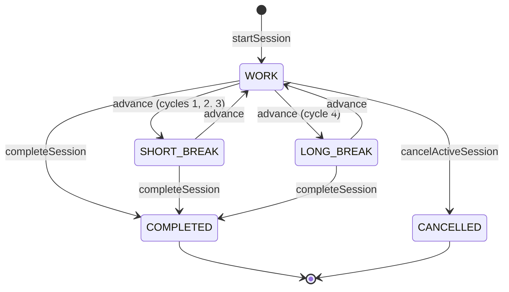
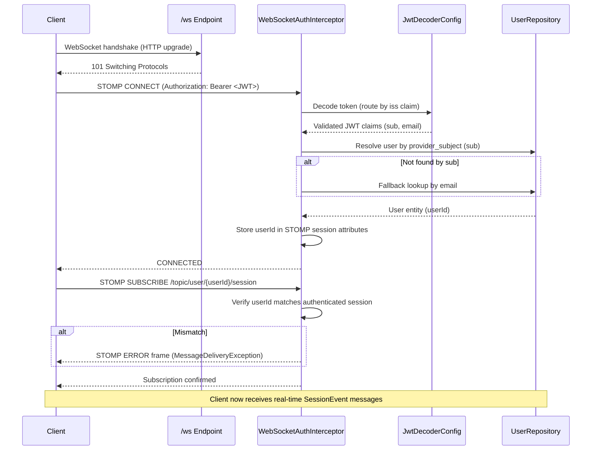
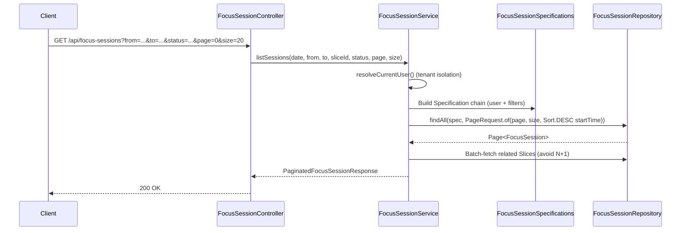
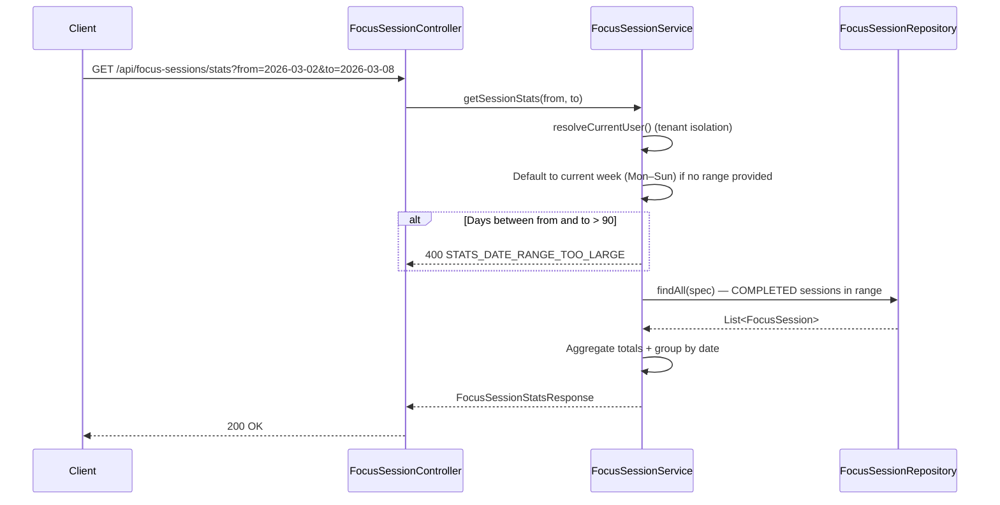
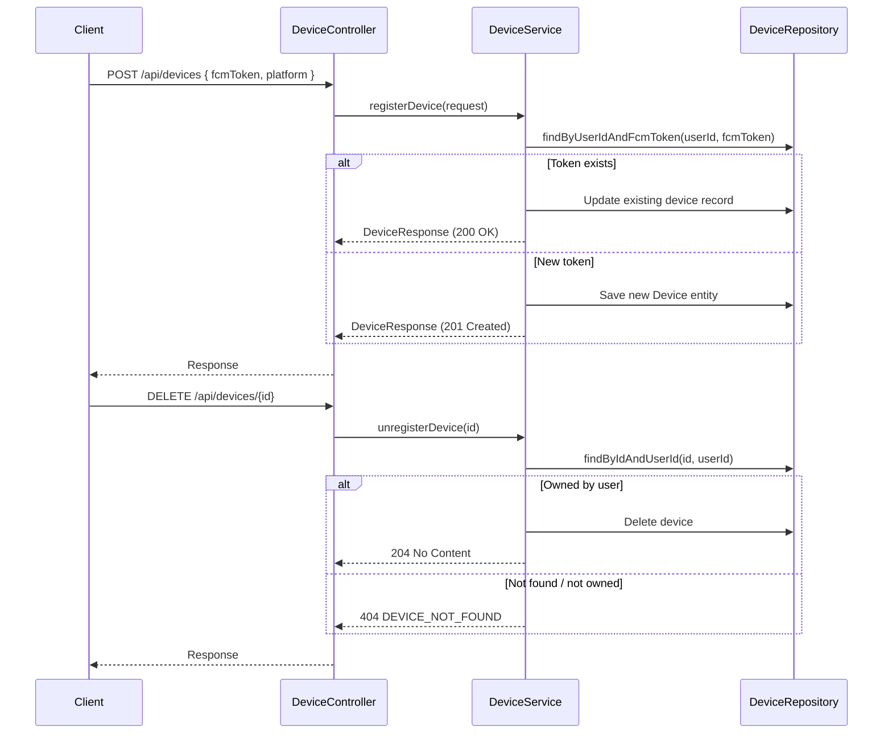
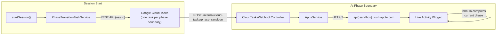

# SliceFocus System Design

## Table of Contents

- [Document Metadata](#document-metadata)
- [1. Goals and Scope](#1-goals-and-scope)
- [2. System Context](#2-system-context-current-state)
- [3. Container/Layer View](#3-containerlayer-view)
- [4. Codebase Mapping](#4-codebase-mapping-tailored-to-current-project)
- [5. Key Runtime Flows](#5-key-runtime-flows)
  - [5.1 Health Check](#51-get-apihealth)
  - [5.2 Protected API Flow](#52-protected-api-flow-eg-get-apiusersme-or-apislices)
  - [5.3 Focus Session Lifecycle](#53-focus-session-lifecycle)
  - [5.4 WebSocket Architecture](#54-websocket-architecture-real-time-session-events)
  - [5.5 Session History](#55-session-history-get-apifocus-sessions)
  - [5.6 Session Stats](#56-session-stats-get-apifocus-sessionsstats)
  - [5.7 Push Notifications (FCM)](#57-push-notification-flow-firebase-cloud-messaging)
  - [5.8 Live Activity (APNS)](#58-live-activity-push-updates-apns)
  - [5.9 User Preferences](#59-user-preferences-getput-apiuserspreferences)
  - [5.10 Actual vs Planned Report](#59-actual-vs-planned-report-get-apireportsactual-vs-planned)
  - [5.11 Productivity Trends](#510-productivity-trends-get-apireportstrends)
  - [5.12 OAuth2 Account Linking](#511-oauth2-account-linking-post-apiauthlink)
  - [5.13 Soundscape Catalog](#512-soundscape-catalog-get-apisoundscapes)
- [6. Data Design](#6-data-design)
- [7. Security Model](#7-security-model)
- [8. Error Handling](#8-error-handling-and-api-consistency)
- [9. Non-Functional Requirements](#9-non-functional-requirements-mvp)
- [10. Deployment and Runtime](#10-deployment-and-runtime-dependencies)
- [11. Architecture Decisions](#11-architecture-decisions-adr-lite)
- [12. Change Checklist](#12-change-checklist-template)

## Document Metadata
- Status: Living document
- Last updated: 2026-03-14
- Owners: Backend maintainers
- Scope: Application architecture (API, domain, persistence, security, runtime behavior)
- Related docs:
  - `docs/architecture.md` (infrastructure and release architecture)
  - `OPERATIONS.md` (deployment and operational procedures)
  - `docs/runbook.md` (incident/ops steps)
  - `src/main/resources/static/openapi/slicefocus-api.yaml` (API contract)

## 1. Goals and Scope
### Goals
- Expose a stable backend API for SliceFocus clients.
- Keep business logic separated from web and persistence layers.
- Preserve contract-first API development via OpenAPI.
- Keep deployment simple for MVP (Cloud Run + Neon PostgreSQL).

### In Scope
- API endpoints implemented by this service.
- Security/authentication model for protected endpoints.
- Data model and repository interaction.
- Runtime dependencies and cross-cutting behavior.

### Out of Scope
- Mobile/web frontend internals.
- Analytics/recommendation pipelines.
- Asynchronous/event-driven architecture beyond WebSocket session events.

## 2. System Context (Current State)


## 3. Container/Layer View


## 4. Codebase Mapping (Tailored to Current Project)
| Package/Path | Responsibility | Notes |
| --- | --- | --- |
| `api/` | HTTP endpoint adapters | Controllers implement generated interfaces (`HealthApi`, `UserApi`, `SliceApi`, `FocusSessionApi`, `ReportApi`, `UserPreferencesApi`, `AuthApi`, `SoundscapeApi`). |
| `application/` | Use-case orchestration | `HealthService`, `UserService`, `SliceService`, `FocusSessionService`, `ReportService`, `UserPreferencesService`, `AccountLinkingService`, `SoundscapeService`. |
| `application/PushNotificationService` | Firebase push delivery | Sends push notifications via Firebase Admin SDK to user-registered devices. |
| `application/SessionNotificationService` | Session event → push dispatch | Triggers push notifications on session phase transitions (advance, complete) and slice-ending warnings. |
| `domain/` | Core persisted entities | `User`, `Slice`, `FocusSession`, `Device`, `UserPreferences` JPA entities. |
| `domain/event/` | WebSocket event contracts | `SessionEvent`, `SessionEventType`, `WebSocketTopics`. |
| `repository/` | Data access abstraction | Spring Data `JpaRepository` interfaces. |
| `repository/FocusSessionSpecifications` | Dynamic query filters | JPA `Specification` builders for session history filtering (date, range, status, slice). |
| `config/` | Cross-cutting runtime config | `SecurityConfig`, `JwtDecoderConfig`, `AuthProperties`, `TimeConfig`, `WebSocketConfig`. |
| `config/WebSocketConfig` | STOMP broker setup | Configures WebSocket endpoint and STOMP message broker for real-time session events. |
| `config/JwtDecoderConfig` | Multi-issuer JWT routing | Routes JWTs to issuer-specific decoders (Google, Apple) based on `iss` claim. |
| `api/error/`, `exception/` | Error contracts and exception translation | Uniform API error responses; robust handling of DB conflicts and unexpected errors. |
| `src/main/resources/db/migration` | Schema evolution | Flyway SQL migrations. |
| `src/main/resources/static/openapi` | API contract source-of-truth | OpenAPI contract drives generated models/interfaces. |

## 5. Key Runtime Flows
### 5.1 `GET /api/health`
1. Request hits `HealthController`.
2. `HealthService` returns status `UP` with `Instant.now(clock)`.
3. Controller responds `200` with `HealthResponse`.

### 5.2 Protected API Flow (e.g., `GET /api/users/me` or `/api/slices`)


### 5.3 Focus Session Lifecycle

- A session starts in `WORK` state with `lifecycleState=WORK`, `status=RUNNING`.
- `advance()` cycles through WORK → SHORT_BREAK → WORK → ... → LONG_BREAK (every 4th cycle) → WORK.
- `completeSession()` finds the active session (RUNNING, or PAUSED via `CANCELLABLE_STATUSES`) for the given slice and updates it in-place to `status=COMPLETED` with an `endTime`. If no matching active session exists (e.g., offline recovery), a new COMPLETED record is created. Terminal states: `COMPLETED`, `CANCELLED`.
- **Flexible start/stop tolerance ([ADR-034](https://github.com/AnunnakiCosmoCrew/slicefocus-docs/blob/main/adr/034-flexible-session-start-stop-tolerance.md)):** *Not yet implemented (see #184, #185).* When a user starts or stops a session, the FE will check the ±5 minute tolerance window. If outside tolerance, the FE updates the slice's start/end time via `PUT /api/v1/slices/{id}`. This is FE-only logic; the backend receives a normal slice update.
- **Real-time notifications:** On each state transition (advance, complete, cancel), the service broadcasts a `SessionEvent` via WebSocket/STOMP to `/topic/user/{userId}/session`. Push notifications via Firebase Cloud Messaging are dispatched on phase advance and session completion (but not cancellation).

### 5.4 WebSocket Architecture (Real-Time Session Events)

#### STOMP Broker Configuration
`WebSocketConfig` (`@EnableWebSocketMessageBroker`) sets up the messaging infrastructure:

| Setting | Value | Purpose |
| --- | --- | --- |
| WebSocket endpoint | `/ws` | Client connection point (with SockJS fallback) |
| Simple broker prefix | `/topic` | Server-to-client message routing |
| App destination prefix | `/app` | Client-to-server message routing |
| Allowed origins | `slicefocus.websocket.allowed-origin-patterns` | CORS control for WebSocket handshake |

#### Authenticated Connection Flow


`WebSocketAuthInterceptor` (`ChannelInterceptor`) intercepts two STOMP commands:
- **CONNECT** — extracts the Bearer JWT from the `Authorization` header, decodes it via the same multi-issuer `JwtDecoderConfig` used by REST, resolves the user from the database, and stores the `userId` in STOMP session attributes.
- **SUBSCRIBE** — enforces topic-level authorization: a client may only subscribe to `/topic/user/{userId}/session` where `{userId}` matches the authenticated session. Unauthorized subscriptions are rejected with `MessageDeliveryException`.

#### Topic Schema
| Topic Pattern | Description |
| --- | --- |
| `/topic/user/{userId}/session` | Per-user session lifecycle events (defined in `WebSocketTopics.SESSION_TOPIC_TEMPLATE`) |

Topics are scoped per-user to enforce tenant isolation — each user receives only their own session events.

#### Session Event Message Format
Events are published as JSON-serialized `SessionEvent` records:

```json
{
  "eventType": "SESSION_ADVANCED",
  "sessionId": "550e8400-e29b-41d4-a716-446655440000",
  "sliceId": "6ba7b810-9dad-11d1-80b4-00c04fd430c8",
  "status": "RUNNING",
  "lifecycleState": "SHORT_BREAK",
  "completedCycles": 2,
  "timestamp": "2026-03-13T10:30:00Z"
}
```

| Field | Type | Description |
| --- | --- | --- |
| `eventType` | `SessionEventType` enum | `SESSION_STARTED`, `SESSION_ADVANCED`, `SESSION_PAUSED`, `SESSION_RESUMED`, `SESSION_COMPLETED`, `SESSION_CANCELLED` |
| `sessionId` | UUID | Focus session identifier |
| `sliceId` | UUID | Linked slice identifier |
| `status` | String | Session status (`RUNNING`, `COMPLETED`, `CANCELLED`) |
| `lifecycleState` | `LifecycleState` enum | Current Pomodoro phase (`WORK`, `SHORT_BREAK`, `LONG_BREAK`) |
| `completedCycles` | int | Number of completed work cycles |
| `timestamp` | Instant | Server-side event timestamp |

#### Event Broadcasting
`FocusSessionService` injects `SimpMessagingTemplate` and broadcasts events on each state transition:

| Operation | Event Type |
| --- | --- |
| `startSession()` | `SESSION_STARTED` |
| `advanceSession()` | `SESSION_ADVANCED` |
| `completeSession()` | `SESSION_COMPLETED` |
| `cancelActiveSession()` | `SESSION_CANCELLED` |

Each call constructs a `SessionEvent` and publishes via `messagingTemplate.convertAndSend(WebSocketTopics.sessionTopic(userId), event)`.

### 5.5 Session History (`GET /api/focus-sessions`)


#### Query Parameters
| Parameter | Type | Required | Default | Notes |
| --- | --- | --- | --- | --- |
| `date` | LocalDate | No | — | Filter sessions on a specific UTC date. Takes precedence over `from`/`to`. |
| `from` | LocalDate | No | — | Inclusive start of UTC date range. Ignored if `date` provided. |
| `to` | LocalDate | No | — | Inclusive end of UTC date range. Ignored if `date` provided. |
| `sliceId` | UUID | No | — | Filter by linked slice ID. |
| `status` | String | No | — | Filter by status (`RUNNING`, `PAUSED`, `COMPLETED`, `CANCELLED`). |
| `page` | int | No | 0 | Zero-indexed page number. |
| `size` | int | No | 20 | Page size (1–100). |

#### Filtering Logic
`FocusSessionSpecifications` builds composable JPA `Specification` predicates. All date filters convert `LocalDate` to UTC `Instant` boundaries (inclusive start, exclusive next-day end). Specifications are chained with `.and()` and always include a `belongsToUser(userId)` predicate for tenant isolation. Results are sorted by `startTime` descending (newest first).

#### Response Shape (`PaginatedFocusSessionResponse`)
```json
{
  "content": [
    {
      "id": "uuid",
      "sliceId": "uuid",
      "taskName": "Deep work",
      "startTime": "2026-03-04T09:00:00Z",
      "endTime": "2026-03-04T09:50:00Z",
      "status": "COMPLETED",
      "workDurationMinutes": 25,
      "breakDurationMinutes": 5,
      "completedCycles": 2,
      "lifecycleState": "WORK",
      "totalFocusMinutes": 50,
      "createdAt": "2026-03-04T08:59:00Z"
    }
  ],
  "page": 0,
  "size": 20,
  "totalElements": 42,
  "totalPages": 3
}
```

### 5.6 Session Stats (`GET /api/focus-sessions/stats`)


#### Query Parameters
| Parameter | Type | Required | Default | Notes |
| --- | --- | --- | --- | --- |
| `from` | LocalDate | No | Current week's Monday (UTC) | Inclusive start of date range. |
| `to` | LocalDate | No | Current week's Sunday (UTC) | Inclusive end of date range. |

The difference between `from` and `to` must not exceed **90 days** (`ChronoUnit.DAYS.between(from, to) > 90` is rejected with `400 STATS_DATE_RANGE_TOO_LARGE`).

#### Aggregation Logic
The service queries all **COMPLETED** sessions for the authenticated user within the effective date range, then computes:

| Metric | Computation |
| --- | --- |
| `totalSessions` | Count of completed sessions |
| `totalFocusMinutes` | Sum of `totalFocusMinutes` across sessions |
| `totalCompletedCycles` | Sum of `completedCycles` across sessions |
| `averageFocusMinutesPerSession` | `totalFocusMinutes / totalSessions` (0.0 if none) |
| `dailyBreakdown` | Sessions grouped by UTC start date, each with per-day `sessions`, `focusMinutes`, `completedCycles` — sorted ascending |

#### Response Shape (`FocusSessionStatsResponse`)
```json
{
  "totalSessions": 12,
  "totalFocusMinutes": 300,
  "totalCompletedCycles": 24,
  "averageFocusMinutesPerSession": 25.0,
  "from": "2026-03-02",
  "to": "2026-03-08",
  "dailyBreakdown": [
    {
      "date": "2026-03-04",
      "sessions": 3,
      "focusMinutes": 75,
      "completedCycles": 6
    }
  ]
}
```

### 5.7 Push Notification Flow (Firebase Cloud Messaging)

#### Firebase Integration
`FirebaseConfig` conditionally initializes `FirebaseMessaging` when `slicefocus.firebase.enabled=true`. The bean accepts either an explicit `credentialsJson` property or falls back to application default credentials (Cloud Run service account).

| Property | Purpose |
| --- | --- |
| `slicefocus.firebase.enabled` | Feature toggle (default: `false`) |
| `slicefocus.firebase.credentials-json` | Service account JSON for FCM authentication |

#### Device Token Registration
Clients register FCM tokens via the `/api/devices` endpoint before receiving push notifications:



Device registration is idempotent — the same `(userId, fcmToken)` pair always resolves to a single record (upsert pattern, enforced by unique index `uk_devices_user_fcm`).

#### Notification Triggers on Session Phase Transitions
```mermaid
flowchart LR
  subgraph Triggers
    A["advanceSession()"] --> SN["SessionNotificationService"]
    B["completeSession()"] --> SN
    C["SliceEndWarningScheduler\n(every 30s)"] --> SN
  end

  SN -->|@Async| PNS["PushNotificationService"]
  PNS --> DR["DeviceRepository\n(fetch user tokens)"]
  PNS --> FCM["Firebase Cloud Messaging"]
  FCM --> D["User's Devices"]
```

All notification methods in `SessionNotificationService` are annotated `@Async` (backed by `AsyncConfig`) to avoid blocking the request thread.

| Trigger | Method | When |
| --- | --- | --- |
| Phase advance | `notifyPhaseAdvanced()` | Pomodoro phase transitions (WORK ↔ SHORT_BREAK ↔ LONG_BREAK) |
| Session complete | `notifySessionCompleted()` | User completes or stops a session |
| Slice ending warning | `notifySliceEndingWarning()` | ~2 minutes before slice end time (scheduler polls every 30s) |

#### Notification Message Templates

**Phase Advanced:**

| New State | Title | Body |
| --- | --- | --- |
| `SHORT_BREAK` | Take a Short Break | Cycle {completedCycles} of {taskName} complete. |
| `LONG_BREAK` | Take a Long Break | 4 cycles of {taskName} complete! |
| `WORK` | Time to Focus | Break is over. Back to {taskName} - cycle {next cycle}. |

**Session Completed:**

| Title | Body |
| --- | --- |
| Session Complete | Great work on {taskName}! |

**Slice Ending Warning:**

| Title | Body |
| --- | --- |
| Slice Ending Soon | Your time slot for {taskName} ends in ~{minutesRemaining} minute(s). |

#### Data Payload
Every push notification includes a structured data payload alongside the display notification. Some keys are conditional — only present for specific event types:

```json
{
  "sessionId": "uuid",
  "sliceId": "uuid",
  "completedCycles": "2",
  "eventType": "PHASE_ADVANCED | SESSION_COMPLETED | SLICE_ENDING_WARNING",
  "lifecycleState": "WORK | SHORT_BREAK | LONG_BREAK",
  "minutesRemaining": "2"
}
```

| Key | Present When |
| --- | --- |
| `sessionId`, `sliceId`, `completedCycles`, `eventType` | Always |
| `lifecycleState` | `PHASE_ADVANCED` only |
| `minutesRemaining` | `SLICE_ENDING_WARNING` only |

#### Stale Token Cleanup
`PushNotificationService` automatically deletes device tokens that Firebase reports as `UNREGISTERED` or `INVALID_ARGUMENT`, keeping the `devices` table clean without manual intervention.

### 5.8 Live Activity Push Updates (APNS + Cloud Tasks)

iOS Live Activities display the Pomodoro timer on the lock screen. The widget computes phase transitions locally using a deterministic formula (ADR-037), but **can only re-render when it receives an APNS content-state push** — iOS platform limitation. Google Cloud Tasks schedules APNS pushes at each phase boundary to trigger re-renders (ADR-038).

#### Architecture Overview



#### Dual Push Architecture

| Channel | Purpose | Token Storage | Payload |
| --- | --- | --- | --- |
| **FCM** (Section 5.7) | Regular notifications (phase alerts, session end, slice warnings) | `devices` table (per-device, long-lived) | Standard notification + data |
| **APNS** (direct) | Live Activity config + re-render triggers | `focus_sessions.live_activity_push_token` (per-activity, ephemeral) | ActivityKit content-state (config-based) |

FCM cannot deliver Live Activity payloads because it does not support the `apns-push-type: liveactivity` header or the `content-state` body format required by ActivityKit.

#### Token Registration

The FE registers the ActivityKit push token after creating a Live Activity:

```
POST /api/v1/focus-sessions/active/live-activity-token
{ "pushToken": "hex-encoded-activitykit-push-token" }
```

The token is stored on the `FocusSession` entity (not in the `devices` table) because ActivityKit tokens are per-activity and expire when the Live Activity ends. An initial APNS push with the session config is sent immediately upon registration.

#### When APNS Pushes Are Sent

| Event | Trigger | APNS Push |
| --- | --- | --- |
| Token registration | Direct | Full session config |
| Phase boundary (work→break, break→work) | Cloud Tasks webhook | Full session config (widget formula computes phase) |
| Pause | Direct | Updated `isPaused`, `totalPausedSeconds` |
| Resume | Direct | Updated `isPaused`, `totalPausedSeconds` |
| Cancel/Complete | Direct | End event (dismiss Live Activity) |

#### Content-State Payload (Config-Based, ADR-037)

```json
{
  "aps": {
    "timestamp": 1712345678,
    "event": "update",
    "content-state": {
      "sessionStartTime": 1712345000,
      "workDurationSeconds": 1500,
      "breakDurationSeconds": 300,
      "longBreakDurationSeconds": 900,
      "cyclesBeforeLongBreak": 4,
      "completedCyclesAtStart": 0,
      "totalPausedSeconds": 0,
      "isPaused": false,
      "maxSessionSeconds": 28800
    }
  }
}
```

The widget uses this config to compute the current phase via `elapsed = effectiveNow - sessionStartTime - totalPausedSeconds`, where `effectiveNow` is the current wall clock time when `isPaused = false`, or frozen at the pause time when `isPaused = true` (since `totalPausedSeconds` is only accumulated on resume).

#### Cloud Tasks Phase Scheduling

When a session starts, `PhaseTransitionTaskService` computes all future phase boundary timestamps and creates one Cloud Task per boundary via the REST API (async, after transaction commit). Each task calls `POST /internal/cloud-tasks/phase-transition` at the scheduled time.

- **Internal webhook**: Not in OpenAPI. Secured via separate `SecurityFilterChain` + `CloudTasksAuthFilter` (OIDC token verification).
- **Idempotent**: If session is no longer RUNNING or has no push token, the webhook returns 200 (no-op).
- **Lifecycle**: Tasks are cancelled on pause/complete/cancel, rescheduled on resume/advance.
- **Task storage**: `focus_sessions.cloud_task_names` (TEXT, JSON array of fully qualified task names).

#### Configuration

| Property | Purpose |
| --- | --- |
| `slicefocus.apns.enabled` | APNS feature toggle (default: `false`) |
| `slicefocus.apns.key-id` | Apple Developer key ID |
| `slicefocus.apns.team-id` | Apple Developer team ID |
| `slicefocus.apns.bundle-id` | App bundle identifier |
| `slicefocus.apns.private-key-base64` | Base64-encoded APNS `.p8` private key (from Secret Manager) |
| `slicefocus.apns.sandbox` | Use sandbox APNS endpoint (default: `false` for prod) |
| `slicefocus.cloud-tasks.enabled` | Cloud Tasks feature toggle (default: `false`) |
| `slicefocus.cloud-tasks.project-id` | GCP project ID |
| `slicefocus.cloud-tasks.location-id` | Cloud Tasks queue location |
| `slicefocus.cloud-tasks.queue-id` | Queue name (`phase-transitions`) |
| `slicefocus.cloud-tasks.service-url` | Cloud Run service URL (webhook target + OIDC audience) |
| `slicefocus.cloud-tasks.service-account-email` | SA for OIDC token signing |

Credentials (APNS private key) are stored in Secret Manager per environment. Cloud Tasks uses Application Default Credentials (automatic on Cloud Run).

### 5.9 User Preferences (`GET/PUT /api/users/preferences`)
- `UserPreferencesService` implements lazy creation: if no preferences row exists for the user, defaults are created on first access (GET or PUT) with theme=LIGHT, notificationEnabled=true.
- PUT performs partial update — only provided fields are changed.
- Theme is validated via enum (LIGHT/DARK); invalid values return 400.
- Concurrent creation handled via `saveAndFlush` + `DataIntegrityViolationException` retry.

### 5.9 Actual vs Planned Report (`GET /api/reports/actual-vs-planned`)
- `ReportService` joins slices with completed focus sessions by `slice_id`.
- Per-slice entries include planned duration (from slice times), actual focus minutes (sum of session `totalFocusMinutes`), completed sessions/cycles, and adherence percent.
- Summary aggregates totals and counts slices with no sessions.
- Supports `date` (single day) and `from`/`to` (date range) query parameters.
- Inverted date ranges rejected with 400 `INVALID_DATE_RANGE`.

### 5.10 Productivity Trends (`GET /api/reports/trends`)
- `ReportService` aggregates session data over weekly (7 days) or monthly periods.
- Daily breakdown includes completed sessions, focus minutes, cycles, and completion rate (completed / all started sessions).
- Period totals include average daily focus and most productive day.
- Days with no sessions appear with zeroed values (no gaps).
- `period` parameter validated: only `week` or `month` accepted (400 otherwise).

### 5.11 OAuth2 Account Linking (`POST /api/auth/link`)
- `AccountLinkingService` validates the provider ID token against Google/Apple JWKS endpoints via `OAuthTokenValidator`.
- Token validation includes signature, expiry, issuer, and audience checks.
- Email from ID token must match the authenticated user's email (403 on mismatch).
- Provider+subject pair must not already be linked to another user (409 on conflict).
- Race condition on concurrent linking handled via `saveAndFlush` + `DataIntegrityViolationException` → 409.
- JwtDecoders are cached per provider in a `ConcurrentHashMap`.

### 5.12 Soundscape Catalog (`GET /api/soundscapes`)
- `SoundscapeService` returns a static, hardcoded catalog of 10 built-in soundscapes.
- Categories: Nature (rain, forest, ocean, thunderstorm), Ambient (cafe, fireplace, library), White Noise (white, brown, pink noise).
- Response includes `Cache-Control: max-age=86400, public` header for client-side caching.
- No database backing — catalog is compiled into the service.

## 6. Data Design
### 6.1 Tables
| Table | Purpose | Key Columns | Constraints/Indexes |
| --- | --- | --- | --- |
| `slicefocus.users` | User identity/profile | `id`, `full_name`, `email`, `provider_subject`, `oauth_provider`, `oauth_subject`, `created_at` | `email` unique; `provider_subject` unique (nullable); `(oauth_provider, oauth_subject)` unique; indexes on `email` and `provider_subject`. |
| `slicefocus.user_preferences` | User preferences | `id`, `user_id`, `theme`, `soundscape_id`, `notification_enabled`, `created_at`, `version` | FK to `users` (CASCADE); `user_id` unique; `@Version` for optimistic locking. |
| `slicefocus.slices` | Time-block entries | `id`, `user_id`, `task_name`, `start_time`, `end_time`, `created_at` | Check `start_time < end_time`; FK to `users`; composite index on `(user_id, start_time)`. |
| `slicefocus.focus_sessions` | Active focus periods | `id`, `slice_id`, `user_id`, `start_time`, `end_time`, `status`, `work_duration_minutes`, `break_duration_minutes`, `completed_cycles`, `lifecycle_state`, `phase_started_at`, `total_focus_minutes`, `slice_end_warning_sent_at`, `version`, `active_session_user_id`, `created_at` | FK to `slices` and `users`; single active session enforced at both **application level** (service check) and **DB level** (unique index on `active_session_user_id`); composite indexes on `(user_id, start_time)` and `(user_id, status)`; `@Version` for optimistic locking. |
| `slicefocus.devices` | Push notification device tokens | `id`, `user_id`, `fcm_token`, `platform`, `version`, `created_at`, `updated_at` | FK to `users` (CASCADE); unique index on `(user_id, fcm_token)`; index on `user_id`. |

### 6.2 Data Invariants
- A user email is globally unique.
- A slice must have a valid time range (`start_time < end_time`).
- Slice ↔ FocusSession: many-to-one (many sessions can reference the same slice).
- A focus session can only be started when the linked slice's date matches today (UTC).
- A user can have at most **one** focus session with status `RUNNING` at any time (enforced at both application and DB levels — service-level check + unique index on `active_session_user_id`).
- All resource access (slices, sessions) is strictly scoped by `user_id` (resolved via authenticated context).
- Session stats date range: the difference between `from` and `to` must not exceed 90 days (`ChronoUnit.DAYS.between > 90` rejected with `400 STATS_DATE_RANGE_TOO_LARGE`).
- A user's `provider_subject` (OIDC `sub` claim) is unique when set. Multiple NULL values are allowed (SQL standard). Once backfilled, the provider_subject is immutable — a mismatch on subsequent login throws `401 Unauthorized`.

## 7. Security Model
### Current Model
- Stateless Spring Security configuration with OAuth2 Resource Server (JWT).
- Multi-issuer JWT validation: Google (`https://accounts.google.com`) and Apple (`https://appleid.apple.com`).
- `JwtDecoderConfig` routes JWTs to issuer-specific `NimbusJwtDecoder` based on `iss` claim.
- Each decoder validates: signature (JWKS), expiry, issuer, and audience.
- `SecurityConfig` extracts `email` claim as principal name.
- Public endpoints (as configured in `SecurityConfig`): `/api/health`, `/openapi/**`, `/swagger-ui/**`, `/swagger-ui.html`, `/v3/api-docs/**`, `/actuator/health`, `/error`, and (under the `component-test` Spring profile) `/api/test/**`.
- Protected endpoints: all others require authenticated JWT, except any additional paths explicitly permitted in `SecurityConfig`.
- IDOR protection: unauthorized resource access returns `404` (not `403`).

### User Resolution Flow
1. Lookup by `provider_subject` (JWT `sub` claim) — primary path.
2. Fallback: lookup by `email` claim, then backfill `provider_subject` — bridges legacy users and Apple first-login.
3. Auto-provision: if no user found, create from JWT claims (`sub`, `email`, `name`/`given_name`+`family_name`).
4. Concurrent provisioning race handled via retry on `DataIntegrityViolationException`.

### Mitigated Risks
| Risk | Status | Implementation |
| --- | --- | --- |
| **Impersonation** | **Mitigated** | Signed JWT validation via JWKS; raw bearer tokens no longer accepted. |
| Missing auth on future endpoints | Mitigated | Secure-by-default (`.anyRequest().authenticated()`); `SecurityConfigTest` verifies JWT principal claim extraction (email as principal, null when absent). |

## 8. Error Handling and API Consistency
- Domain/application exceptions extend `ApiException`.
- `GlobalExceptionHandler` ensures:
  - Domain errors map to stable codes (e.g., `SLICE_TEMPORAL_INVALID`, `ACTIVE_SESSION_CONFLICT`, `SLICE_DATE_NOT_TODAY` (422), `STATS_DATE_RANGE_TOO_LARGE` (400)).
  - Unauthorized access to other users' data returns `404 NOT FOUND` (IDOR protection/obscurity).
  - Unexpected errors return `500 INTERNAL_SERVER_ERROR`.
  - Secondary errors in path resolution are prevented via `safePath`.

## 9. Non-Functional Requirements (MVP)
- **Reliability:** Simple layered design with synchronous DB calls; target 99.9% availability for the API service.
- **Performance:** Low-latency target for core CRUD; Neon PostgreSQL serverless provides adequate scale for early users.
- **Observability:** Centralized logging at DEBUG level for dev/test and INFO for prod; `GlobalExceptionHandler` captures and logs all boundary failures.

## 10. Deployment and Runtime Dependencies
- Runtime: Spring Boot service on Cloud Run.
- Database: Neon PostgreSQL (Managed).
- Migrations: Flyway SQL.
- Secrets: Secret Manager injection (configured in `deploy.sh`).
- Push Notifications: Firebase Admin SDK (FCM for regular notifications) + direct APNS HTTP/2 client (Live Activity content-state updates).

## 11. Architecture Decisions (ADR-Lite)
| Date | Decision | Status | Rationale |
| --- | --- | --- | --- |
| 2026-02 | Contract-first API (OpenAPI generated models/interfaces) | Accepted | Reduces drift between API spec and implementation. |
| 2026-02 | Layered package structure (`api`, `application`, `domain`, `repository`) | Accepted | Improves separation of concerns and testability. |
| 2026-02 | Cloud Run + Neon for MVP | Accepted | Lower operational overhead/cost for early stage. |
| 2026-03 | Database-level Session Guardrail | **Accepted** | Implemented via `active_session_user_id` unique index (set to `userId` when RUNNING, NULL otherwise) + `@Version` optimistic locking. Concurrent conflicts caught at both application (pre-check) and DB (unique constraint → `DataIntegrityViolationException` → `ActiveFocusSessionConflictException`) levels. |
| 2026-03 | Multi-issuer JWT/OIDC authentication (Google + Apple) | **Accepted** | Replaced placeholder bearer-token auth with Spring Security OAuth2 Resource Server. `JwtDecoderConfig` routes tokens by `iss` claim to issuer-specific JWKS decoders. User identity resolved by `provider_subject` (JWT `sub`) with email fallback and auto-provisioning. Apple first-login profile data captured on initial auth. |
| 2026-03 | WebSocket with STOMP broker for real-time session events | **Accepted** | Enables instant UI updates on session state transitions (advance, complete, cancel) without polling. `WebSocketConfig` configures the STOMP broker; events published to `/topic/user/{userId}/session`. |
| 2026-03 | Firebase Cloud Messaging for push notifications | **Accepted** | Delivers push notifications to mobile devices on session phase transitions. Firebase Admin SDK integrated server-side; device tokens managed via `devices` table and `/api/devices` endpoint. |
| 2026-03 | Composite DB indexes for analytics query optimization | **Accepted** | Replaced single-column indexes on `focus_sessions(user_id)` and `slices(user_id)` with composite indexes `(user_id, start_time)` and `(user_id, status)` to optimize session history and stats queries. Added missing FK constraints to `users`. |
| 2026-03 | User preferences with lazy creation | **Accepted** | Preferences are created on first access (GET or PUT) rather than at user provisioning time. Simplifies user creation flow and avoids unused rows. |
| 2026-03 | Actual-vs-planned and productivity trends as report endpoints | **Accepted** | Separate `/api/reports/*` namespace for analytics endpoints. Aggregation done in-memory from JPA queries rather than database-level aggregation (adequate for current scale). |
| 2026-03 | OAuth2 account linking via ID token validation | **Accepted** | `POST /api/auth/link` validates provider ID tokens against JWKS endpoints, enforces email match, and stores `(oauth_provider, oauth_subject)` on the user. Supports Google and Apple. |
| 2026-03 | Static soundscape catalog (no database) | **Accepted** | Soundscapes are built-in, not user-created. Hardcoded list avoids schema complexity and allows `Cache-Control` caching. |
| 2026-03 | Checkstyle for code quality gates | **Accepted** | `maven-checkstyle-plugin` enforces coding standards (imports, braces, line length, etc.) during `verify` phase. Config in `checkstyle.xml`. |

## 12. Change Checklist (Template)
Use this for every significant backend change:
- API contract updated (if endpoint/schema changed).
- Controller/service/repository impact assessed.
- Migration required and rollback considered.
- Security impact reviewed.
- Unit tests updated.
- Component/integration tests updated.
- Documentation updated (`docs/system-design.md`, runbook, operations).
